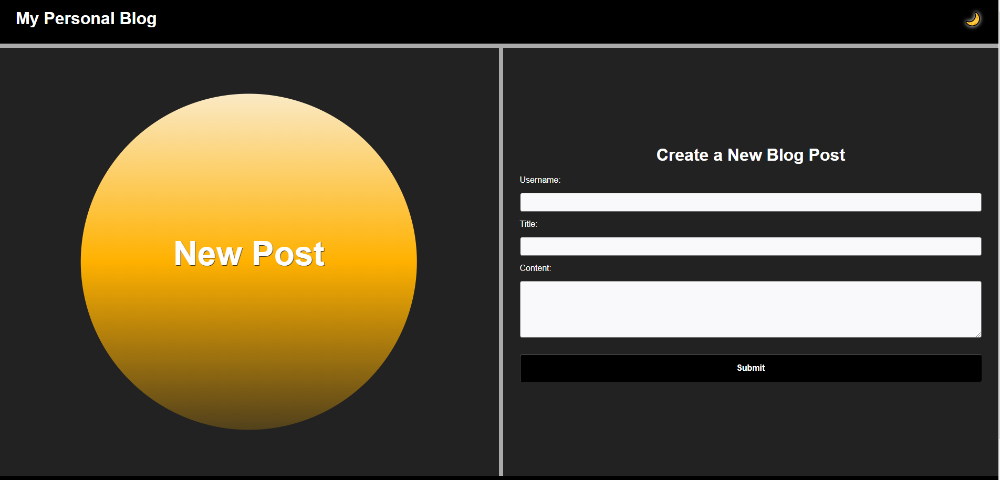
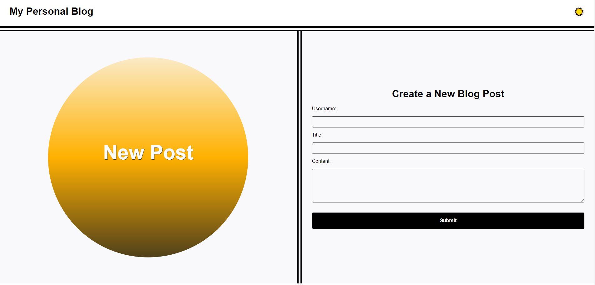
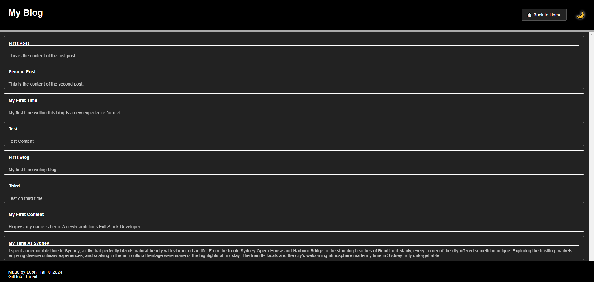
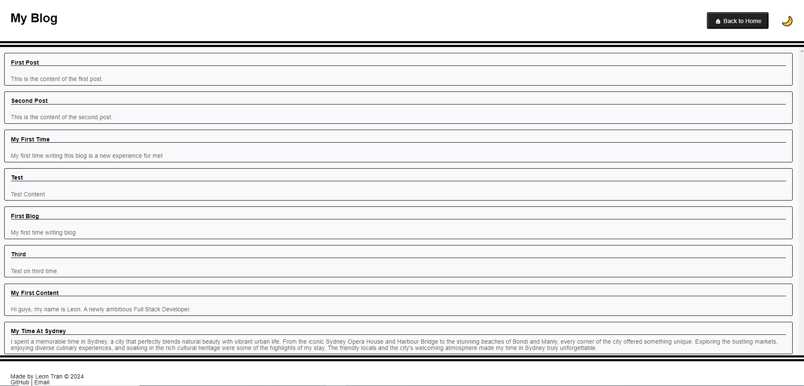

  
  # Personal Blog
  > Module 4 Challenge
  

  
  
  

  

## Description

This repository contains the code for personal blog website, allowing users to enter and display blog posts. Key features include:
- a content submit form, 
- dynamically rendered posts, includinng a light/dark mode switch. 

The project is developed using JavaScript and utilizes the Document Object Model (DOM) to manage webpage interactions.

## Task 
To successfully solve the challenge, codes were written into 5 main files:
### blog.js
    Reads blog posts from local storage, dynamically creates and appends HTML elements to display these posts on the webpage. If no posts are found, it displays a message indicating that there are no blog posts available.
### form.js
    Handles the form submission by capturing the input data, storing it in local storage, and redirecting the user to the blog page. It also displays an error message if any form fields are empty.
### logic.js
    Toggles between light and dark modes by adding or removing relevant CSS classes to the body and saves the current mode to local storage. It also restores the last saved mode when the page loads by reading from local storage.
### blog.html
    Displays blog posts stored in local storage and allows users to toggle between light and dark themes, with links to the landing page. It dynamically updates content using JavaScript files logic.js and blog.js.
### index.html
    Serves as the landing page for the website, containing a form where users can submit new blog posts. When the form is submitted, it collects the user's input and stores it in local storage before redirecting to the blog.html page to display the new post.

## Final Product

## Reference
- [USYD Bootcamp](https://techbootcamp.sydney.edu.au/coding/)
- [toLocaleString](https://developer.mozilla.org/en-US/docs/Web/JavaScript/Reference/Global_Objects/Date/toLocaleString)

## Deploy

1. Access the HTML source code through the repo or within a Chromium/Firefox browser by pressing `F12` or `Control+Shift+I` (Windows) or `Command+Option+I` (MacOS). 

2. Click on this link http://leontran44.github.io/personal-blog/ to access to the deployment webpage.

## License
[MIT License](https://opensource.org/licenses/MIT)